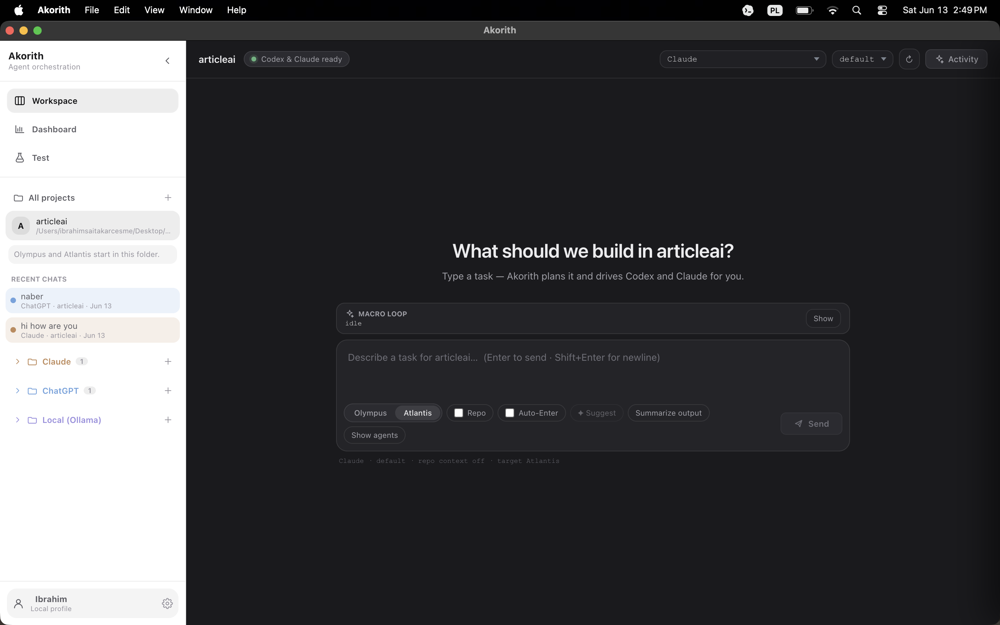

# Akorith

**Akorith orchestrates your logged-in AI coding agents — it does not require API keys.**

Akorith is a cross-platform Electron desktop app that drives the coding agents you already
pay for, through their official command-line tools. You log into those CLIs once in your
terminal; Akorith runs them locally inside your chosen project. There are no API keys to
paste and no provider credentials stored by the app.

```
┌────────────┬─────────────────────────────────────────────┐
│  Sidebar   │  Workspace: project planning + agents       │
│ projects   │  Chat: general model conversations          │
│ providers  │  Test: generate tests + export PDF reports  │
└────────────┴─────────────────────────────────────────────┘
```

## What it supports

- **Claude** — via the `claude` CLI (your Claude subscription/login).
- **Codex / ChatGPT** — via the `codex` CLI (your ChatGPT login).
- **Local models** — via a local **Ollama** server when one is running (optional).

The center chat talks to whichever of these are installed and logged in. In **Workspace**,
Akorith also hosts two real project terminals in the Activity drawer: **Olympus** runs Codex
and **Atlantis** runs Claude inside the project folder you pick. In **Chat**, you can talk to
Claude, ChatGPT/Codex, or Local models without selecting a project.

## Workspace vs Chat

- **New chat** sits at the top of the sidebar (above Workspace). Click it any time to start a
  fresh general chat with your current provider — no project required.
- **Workspace** is project-scoped. Selecting a project restores that project's latest workspace
  chat if one exists, starts or reuses Olympus/Codex and Atlantis/Claude for that project, and
  enables repo context, macro-loop, bridge, and Activity controls.
- **Chat** is general model chat. It works without a project, stores conversations separately
  from project workspaces, and does not show or send project context.
- **Recent Chats** shows both kinds of conversation and restores the correct mode and context.
- The **provider/model switcher** is a labeled pill in the top bar of every chat.

## Conversation memory

Each chat is a real, continuous conversation: when you send a message, Akorith sends the
model this session's previous turns, so it remembers what you said earlier in the same chat.
A compact **memory indicator** under the text box shows how much is included (e.g.
`Memory: 14 msgs`, plus `Repo on` in a Workspace, or `summarized` for very long chats), with
a tooltip explaining what the model sees. Long chats are kept within a sensible window —
recent turns are sent in full, and older ones are compressed into a short running summary so
the chat still remembers without sending unbounded history. A **Reset context** button
(two-click) clears the memory for the current chat only — it never touches your other chats.
Memory is strictly per-chat: a new chat starts fresh, separate chats don't see each other's
history, and each project workspace keeps its own conversation.

## Agent permission prompts & output summaries

When Olympus/Codex or Atlantis/Claude pauses on a confirmation in its terminal (`proceed?`,
`y/n`, a numbered menu, `allow access?`, `press Enter`), Akorith surfaces it as a **permission
card** right in the chat with answer buttons — you don't have to open the Activity drawer. Your
answer is sent through the same single bridge path that all chat→terminal text uses. Permanent
"always allow" options are shown but never auto-selected. After you send work to an agent (or
answer a prompt), Akorith watches the terminal until it settles and posts a **summary** of what
the agent did back into the chat; a **Summarize output** button is always available too.

## Connect your subscriptions

> **Install Claude CLI and Codex CLI, log into both in your terminal, then open Akorith and
> select a project.**

In more detail:

1. **Claude** — install the `claude` CLI and run it once to log in (uses your Claude
   subscription).
2. **Codex** — install the `codex` CLI and log in with your ChatGPT account.
3. **Ollama (optional)** — install [Ollama](https://ollama.com), start it
   (`http://localhost:11434`), and pull at least one model for local/offline use.

Akorith detects whichever tools are present; any subset works, and a missing tool simply
shows as unavailable instead of breaking the app.

## Run in development

```bash
npm install      # also rebuilds better-sqlite3 for Electron + fixes the macOS spawn-helper
npm run dev       # electron-vite dev server + Electron window
npm run typecheck # tsc over main, preload, and renderer
```

> Node.js 22+ recommended (20+ works). macOS (Apple Silicon) and Windows 10 1809+ are
> supported; Linux is untested.

## Build / package the desktop app

Akorith packages with **electron-builder**. The product identity (name, icon, bundle id)
is configured under the `build` field in `package.json`.

```bash
npm run pack:mac   # fast unpacked .app  → dist/mac-arm64/Akorith.app
npm run dist:mac   # installers (.dmg + .zip) → dist/
npm run dist:win   # Windows installer config (build on Windows)
```

The packaged macOS app is named **Akorith** in Finder, the Dock, and the menu bar, and uses
the Akorith icon. (In `npm run dev` the macOS menu/Dock still read "Electron" — that name
comes from the dev Electron bundle and only the packaged build can override it.)

## Privacy & security

- **Akorith stores no provider API keys and no AI-provider credentials.** It relies entirely
  on the logins already held by your `claude` / `codex` CLIs (and your local Ollama).
- App data is kept **locally** in SQLite (`loopex.db`) and a small JSON config
  (`loopex.config.json`) in your OS user-data directory — chat history, usage stats, project
  metadata, and settings only.
- **Terminal commands run locally** in the project folder you select, on your machine.
- Electron is locked down: context isolation on, sandbox on, Node integration off, a frozen
  preload bridge, a strict CSP, and prompts passed to CLIs over **stdin (never as shell
  arguments)**. There is a single programmatic path that can type into a terminal.

## Macro-loop: Approval & Auto modes

The macro-loop drives a planner → executor cycle toward a goal you set.

- **Approval Mode (default)** — the planner proposes one step; you approve or edit it before
  anything is sent. You stay in control of every send.
- **Auto Mode (opt-in)** — Akorith can continue the cycle with less manual copying: it sends the
  planner's prompt, reads a **read-only snapshot** of the terminal to summarize the result, and
  continues. It is deliberately cautious — it auto-answers only **low-risk, one-time**
  confirmations, **pauses** for anything medium/high-risk, destructive, low-confidence, or
  ambiguous, **never** selects "always allow", and **Stop** always interrupts it.

## Test Lab and PDF reports

The Test route can generate tests in an isolated sandbox, compute ISAScore for selected runs,
and export the evaluation as a PDF. Exported PDFs are saved to your **Downloads** folder with an
`akorith-...pdf` filename; Akorith shows the exact saved path and provides **Reveal** and
**Open** actions.

To make generated tests more likely to actually run and pass, Akorith reads a bounded, read-only
snapshot of your repo's source structure and a few sample files and feeds them to the model, with
framework-specific rules (import the real modules, correct pytest/vitest/jest syntax, no
empty/"0 tests"). If a generated test still fails, a **Repair & rerun** button sends the failing
file plus the sandbox output back to the model for a corrected version and reruns it once — your
source repo is never modified. A 12-run validation across pytest, vitest, and jest on real
projects is recorded in `docs/validation/testlab-10-run-validation.md`.

## Current limitations

- **Auto Mode is cautious, not unlimited autonomous coding** — it pauses for you on anything
  risky and stops on repeated failures or low confidence.
- **No permanent "always allow"** auto-selection — only one-time approvals.
- **Terminal-output parsing is heuristic/model-assisted** and may need your review.
- **No automatic approval of risky permission prompts** — Akorith never auto-answers
  destructive or medium/high-risk prompts.
- **Ollama is optional** and may be absent; local-model features degrade gracefully.
- Packaged builds are not yet code-signed/notarized for public distribution (Gatekeeper may
  warn on first open on other machines).

## Design

Akorith is **chat-first**, in the spirit of a Codex-style product: a **light/white sidebar** for
projects, provider folders, recent chats, and navigation; a **dark, calm center workspace** built
around one large composer; and the Codex/Claude **terminals running in the background**, revealed
only when you want them via the **Agent activity** drawer. Pick a project from the sidebar and
Akorith starts or reuses Codex and Claude in it automatically — you mostly just chat, and the
agents work behind the scenes. After you send work to an agent, Akorith reads its terminal output
and **summarizes the result back into the chat** ("Olympus/Codex created the files and ran tests —
how would you like to continue?"), with a manual **Summarize output** action too. The separate
**Chat** route is for normal, project-free conversations with any available provider.



_More screenshots / a short demo clip can be added before public launch._

## More

- [AGENTS.md](AGENTS.md) — architecture, provider contract, packaging notes (AI/agent handoff).
- [codex.md](codex.md) — shorter "how we work + where we are" companion.
- [docs/release-checklist.md](docs/release-checklist.md) — build / launch / publish checklist.
