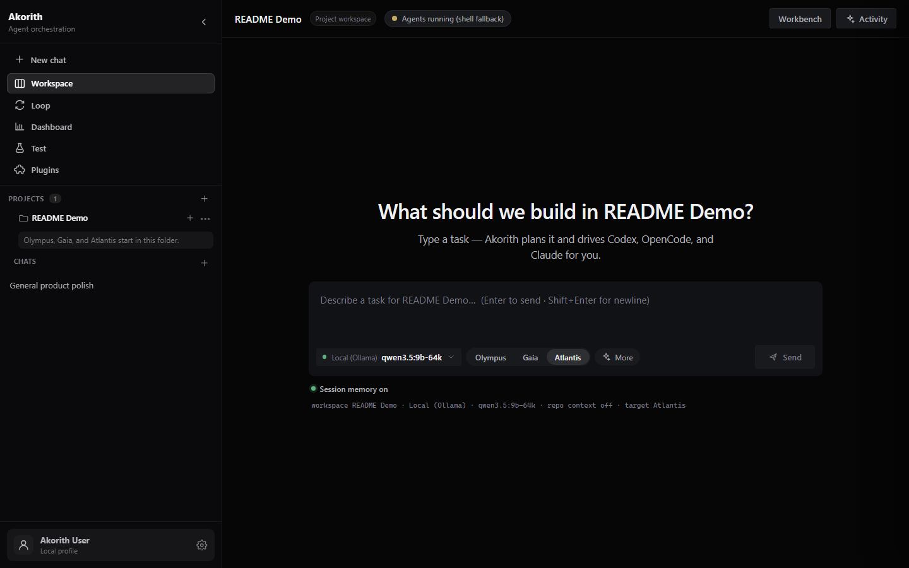
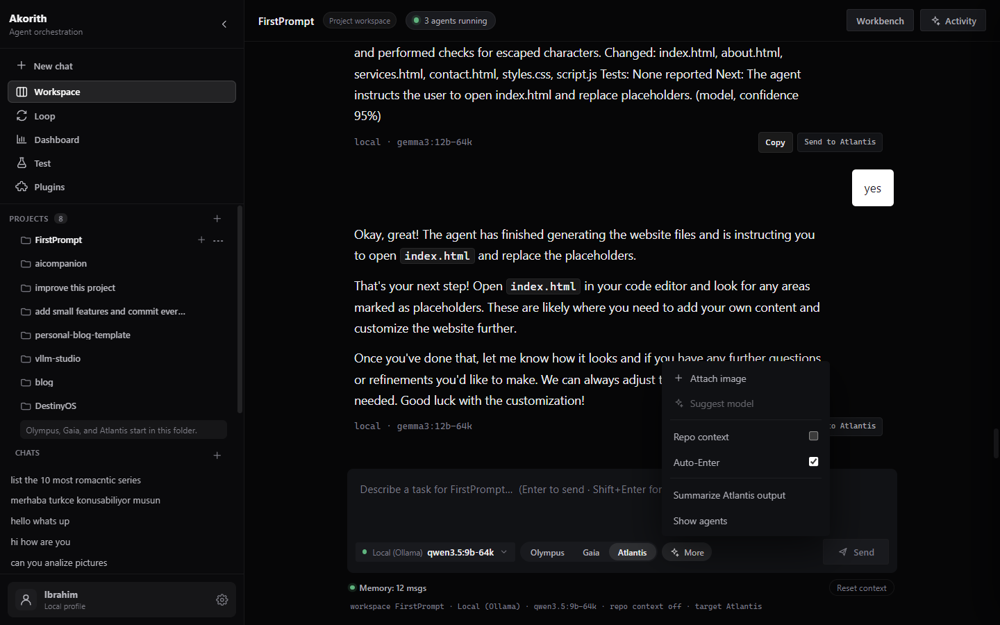
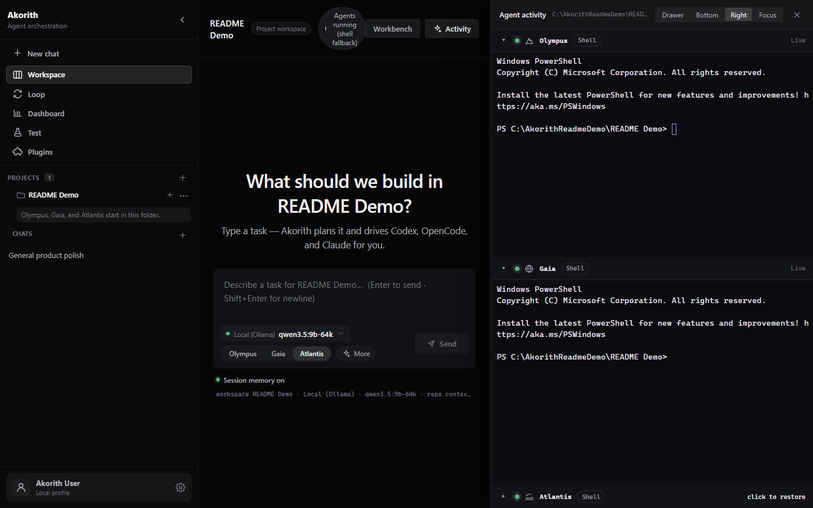
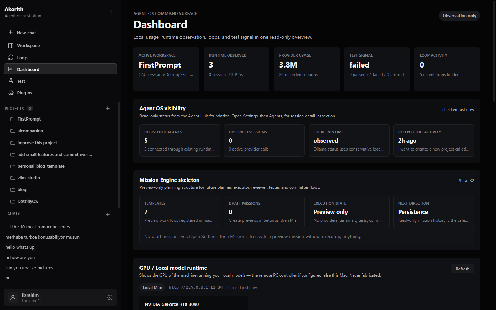
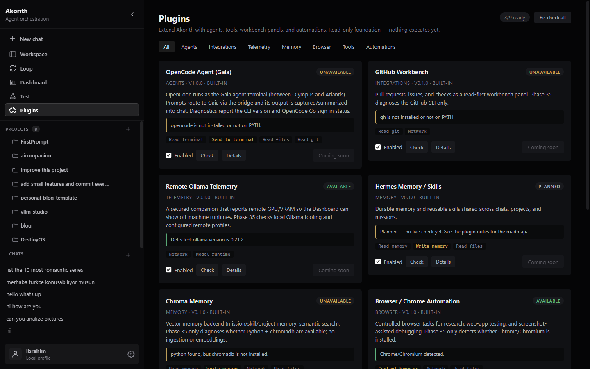
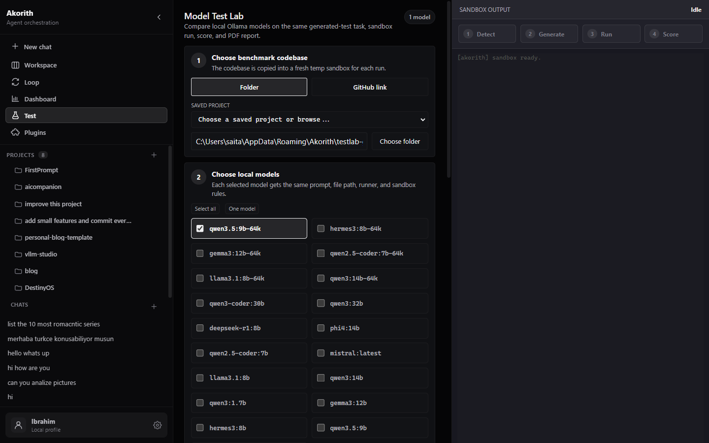
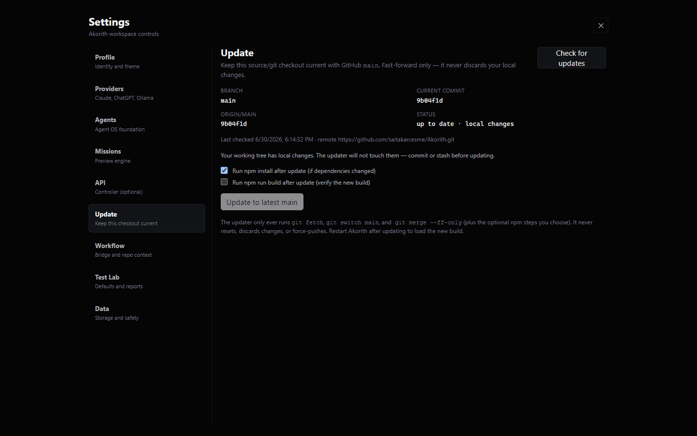

# Akorith

**Akorith — a local-first Agent OS for AI coding workflows. No API keys.**

Akorith is a cross-platform Electron desktop app that drives the coding agents you already
pay for, through their official command-line tools. You log into those CLIs once; Akorith
runs them locally inside your chosen project. There are no API keys to paste and no provider
credentials stored by the app — your chats, usage, and project metadata stay in local SQLite.

```
┌────────────┬─────────────────────────────────────────────┐
│  Sidebar   │  Workspace: project planning + 3 agents     │
│ projects   │  Dashboard: usage, agents, GPU, controller  │
│ chats      │  Plugins · Loops · Test Lab · Settings       │
└────────────┴─────────────────────────────────────────────┘
```

## What it supports

- **Claude** — via the `claude` CLI (your Claude subscription/login).
- **Codex / ChatGPT** — via the `codex` CLI (your ChatGPT login).
- **OpenCode** — via the `opencode` CLI (`opencode auth login`).
- **Local models** — via a local **Ollama** server when one is running (optional).

The center chat talks to whichever of these are installed and logged in. In **Workspace**,
Akorith hosts three real project terminals in the Activity drawer:
**Olympus** (Codex), **Gaia** (OpenCode), and **Atlantis** (Claude), each running inside the
project folder you pick. A fresh **New chat** can also run as a general, project-free
conversation with any available provider.

## Workspace vs Chat

- **New chat** sits at the top of the sidebar (above Workspace). Click it any time to start a
  fresh general chat with your current provider — no project required.
- **Workspace** is project-scoped. Selecting a project restores that project's latest workspace
  chat if one exists, starts or reuses Olympus/Codex, Gaia/OpenCode, and Atlantis/Claude for
  that project, and enables repo context, macro-loop, bridge, and Activity controls.
- **Chat** is general model chat. It works without a project, stores conversations separately
  from project workspaces, and does not show or send project context.
- **Recent Chats** shows both kinds of conversation and restores the correct mode and context.
- The **provider/model switcher** is a labeled pill in the top bar of every chat.

## Major surfaces

- **Workspace** — sidebar · chat composer · three agent terminals (Olympus/Gaia/Atlantis).
- **Dashboard** — local usage stats, agent OS snapshot, **Claude/Codex usage-limit cards**,
  GPU/runtime telemetry, controller + plugin status, and a source-update badge.
- **Agent Hub** — the Agent OS foundation (adapters, runtime snapshot) in Settings → Agents.
- **Plugins** — read-only plugin registry + diagnostics (Browser, Chroma memory, …).
- **Controller API** — optional loopback-only, token-protected, read-only HTTP+SSE surface
  for companions/CLIs (Settings → API; see `docs/controller-api.md`).
- **Loops** — the AkorithLoop planner/observer surface.
- **Test Lab** — generate + run tests in a sandbox and export scored PDF reports.
- **Bottom workbench** — Changes / Runtime / Missions panel.
- **Settings → Update** — keep this source checkout current with GitHub `main`.

## Install

Three ways to run Akorith (full details in [`docs/install.md`](docs/install.md)):

1. **Download a release** — grab the artifact for your OS from the **Releases** page:
   - macOS: `Akorith-<version>-mac-<arch>.dmg` (or `.zip`) → drag **Akorith.app** to Applications.
   - Windows: `Akorith-Setup-<version>-x64.exe` (installer) or `Akorith-<version>-portable-x64.exe`.

   Builds are currently **unsigned** — on macOS right-click → **Open** the first time; on
   Windows choose **More info → Run anyway**. Signing/notarization is planned.

2. **Build from source (macOS):**

   ```bash
   git clone https://github.com/saitakarcesme/Akorith.git
   cd Akorith
   npm install
   npm run dist:mac      # build dmg + zip
   npm run refresh:mac   # back up old copies + install + open Akorith.app
   ```

3. **Build from source (Windows):**

   ```powershell
   git clone https://github.com/saitakarcesme/Akorith.git
   cd Akorith
   npm install
   npm run dist:win      # build installer + portable app
   npm run refresh:win   # clean stale shortcuts, install, launch
   ```

   Use the generated installer for normal use. If Windows still shows an Electron
   icon, uninstall old Akorith/Electron entries that belong to Akorith, delete stale
   shortcuts/taskbar pins, reinstall the latest `Akorith-Setup-<version>-x64.exe`,
   then restart Explorer or clear the Windows icon cache.

4. **Run in development:**

   ```bash
   npm run setup        # check toolchain, install deps, print exact auth steps
   npm run dev          # launch the desktop app
   ```
   Dev mode is for development and may expose Electron runtime identity in OS shell
   surfaces. The **packaged** app should show Akorith branding/icons everywhere.

   Existing projects and chats are loaded from the local Akorith userData folder
   on launch. If a packaged app ever opens to an empty-looking sidebar, fully quit
   and reopen packaged Akorith first; do not delete `loopex.db`, which stores local
   project/chat history. See [`docs/phase-42-startup-data-hydration.md`](docs/phase-42-startup-data-hydration.md).

One-command setup works on macOS/Linux (`scripts/setup-akorith.sh`) and Windows
(`scripts/setup-akorith.ps1`); `npm run doctor` runs a check-only pass. It never collects or
stores secrets — it only prints the sign-in commands for the tools you use. See
[`docs/setup.md`](docs/setup.md).

Maintainers cut releases via the GitHub Actions **release** workflow
(`workflow_dispatch` or pushing a `v*` tag). It ships as `ci/release.yml` and is activated by
copying it to `.github/workflows/release.yml` (one-time; needs a `workflow`-scoped token or
the GitHub web UI) — see [`docs/packaging.md`](docs/packaging.md).

## Keeping machines current (in-app updates)

Tired of `git pull` on every Mac and PC? Open **Settings → Update**: it checks GitHub `main`,
shows how far behind you are, and **fast-forwards safely** (`git fetch` → `git switch main` →
`git merge --ff-only`, with optional `npm install`/`build`). It never resets, discards local
changes, or force-pushes. See [`docs/update-system.md`](docs/update-system.md).

## Managing projects and chats

- **Project menu:** hover a project in the sidebar and open its `⋯` menu → **Rename**, **Reveal in
  Finder** (opens the project's folder), or **Remove from Akorith**. Removing a project takes it —
  and its workspace chats — out of Akorith's list. **It does not delete the folder or any files on
  disk;** re-add it any time with **Open Project**. If you remove the project you're currently in,
  Akorith returns to a clean no-project Workspace. The menu closes on Escape or an outside click.
- **Delete a chat:** hover an entry under **Recent Chats** and click **Delete** (click again to
  confirm). This removes that conversation; deleting the chat you're in opens a clean new chat.

## Sending prompts to the agents (Auto-Enter)

In a Workspace chat, assistant responses can be sent to **Olympus**, **Gaia**, or
**Atlantis** through Akorith's single bridge path. The target selector sits beside the
composer, while secondary tools live under **More**: image attach, model suggestion, repo
context, Auto-Enter, output summary, and Agent Activity. **Auto-Enter ON** pastes and submits
the prompt immediately; **OFF** pastes it and leaves the cursor so you can review first.

## Conversation memory

Each chat is a real, continuous conversation: when you send a message, Akorith sends the
model this session's previous turns, so it remembers what you said earlier in the same chat.
A compact **memory indicator** under the text box shows how much is included (e.g.
`Memory: 14 msgs`, plus `Repo on` in a Workspace, or `summarized` for very long chats), with
a tooltip explaining what the model sees. Long chats are kept within a sensible window —
recent turns are sent in full, and older ones are compressed into a short running summary so
the chat still remembers without sending unbounded history. A **Reset context** button
(two-click) clears the memory for the current chat only — it never touches your other chats.
Memory is strictly per-chat: a new chat starts fresh, separate chats don't see each other's
history, and each project workspace keeps its own conversation.

## Agent permission prompts & output summaries

When Olympus/Codex, Gaia/OpenCode, or Atlantis/Claude pauses on a confirmation in its terminal
(`proceed?`, `y/n`, a numbered menu, `allow access?`, `press Enter`), Akorith surfaces it as a
**permission card** right in the chat with answer buttons — you don't have to open the Activity
drawer. Your answer is sent through the same single bridge path that all chat→terminal text
uses. Permanent "always allow" options are shown but never auto-selected. After you send work to
an agent (or answer a prompt), Akorith watches the terminal until it settles and posts a
**summary** of what the agent did back into the chat; a **Summarize output** button is always
available too.

## Connect your subscriptions

> **Install Claude CLI and Codex CLI, log into both in your terminal, then open Akorith and
> select a project.**

In more detail:

1. **Claude** — install the `claude` CLI and run it once to log in (uses your Claude
   subscription).
2. **Codex** — install the `codex` CLI and log in with your ChatGPT account.
3. **OpenCode (Gaia)** — `npm i -g opencode-ai`, then `opencode auth login` (also runnable
   inside Akorith's Gaia pane).
4. **Ollama (optional)** — install [Ollama](https://ollama.com), start it
   (`http://localhost:11434`), and pull at least one model for local/offline use.
5. **GitHub CLI (optional)** — `gh auth login` for repo operations.

Akorith detects whichever tools are present; any subset works, and a missing tool simply
shows as unavailable instead of breaking the app.

Akorith also tries to auto-start `ollama serve` when the default local provider
(`http://localhost:11434`) is down. By default it starts Ollama with LAN binding
(`OLLAMA_HOST=0.0.0.0:11434`) and, on another machine such as a MacBook, scans the
private LAN for a reachable Ollama `/api/tags` endpoint when localhost is unavailable.
That lets a MacBook use the models exposed from a running Windows host PC. If Ollama was
already running localhost-only on the host, restart Ollama/Akorith once so it can bind to LAN.

## Run in development

```bash
npm install      # also rebuilds better-sqlite3 for Electron + fixes the macOS spawn-helper
npm run dev       # electron-vite dev server + Electron window
npm run typecheck # tsc over main, preload, and renderer
```

> Node.js 22+ recommended (20+ works). macOS (Apple Silicon) and Windows 10 1809+ are
> supported; Linux is untested.

## Build / package the desktop app

Akorith packages with **electron-builder**; identity (name, icon, bundle id) and targets are
configured under the `build` field in `package.json`. Full guide: [`docs/packaging.md`](docs/packaging.md).

```bash
npm run release:check   # read-only preflight (identity, icons, targets, git, tag)
npm run pack:mac        # fast unpacked .app  → dist/mac*/Akorith.app
npm run dist:mac        # installers (.dmg + .zip) → dist/
npm run dist:win        # Windows nsis + portable (build on Windows or via CI)
npm run refresh:mac     # back up old copies + install the new Akorith.app + open it
```

The packaged app is named **Akorith** in Finder, the Dock, and the menu bar (verified:
`CFBundleName`/`CFBundleDisplayName`/`CFBundleExecutable` = Akorith). In **dev**, the menu
bar may still read "Electron" — electron-vite launches the Electron binary directly, so macOS
takes the app name from the running executable, which `app.setName` and the Info.plist patch
(`scripts/fix-dev-app-name.js`, best-effort) can't reliably override. The packaged app is the
one users run. A macOS host can't reliably cross-build the Windows installer; use the GitHub
Actions **release** workflow for Windows artifacts. Builds are **unsigned** until signing
certs are configured (never faked).

## Privacy & security

- **Akorith stores no provider API keys and no AI-provider credentials.** It relies entirely
  on the logins already held by your `claude` / `codex` CLIs (and your local Ollama).
- App data is kept **locally** in SQLite (`loopex.db`) and a small JSON config
  (`loopex.config.json`) in your OS user-data directory — chat history, usage stats, project
  metadata, and settings only.
- **Terminal commands run locally** in the project folder you select, on your machine.
- Electron is locked down: context isolation on, sandbox on, Node integration off, a frozen
  preload bridge, a strict CSP, and prompts passed to CLIs over **stdin (never as shell
  arguments)**. There is a single programmatic path that can type into a terminal.

## Macro-loop: Approval & Auto modes

The macro-loop drives a planner → executor cycle toward a goal you set.

- **Approval Mode (default)** — the planner proposes one step; you approve or edit it before
  anything is sent. You stay in control of every send.
- **Auto Mode (opt-in)** — Akorith can continue the cycle with less manual copying: it sends the
  planner's prompt, reads a **read-only snapshot** of the terminal to summarize the result, and
  continues. It is deliberately cautious — it auto-answers only **low-risk, one-time**
  confirmations, **pauses** for anything medium/high-risk, destructive, low-confidence, or
  ambiguous, **never** selects "always allow", and **Stop** always interrupts it.

## Test Lab and PDF reports

The Test route is intentionally simple: pick a local repo or paste a GitHub repo URL, pick the kind
of test you want (debug, security, core unit logic, edge cases, or UI behavior), let Local/Ollama
generate and run tests in an isolated sandbox, then score selected runs with Claude or ChatGPT to
produce ISAScore. GitHub URLs are cloned into Akorith's local managed cache before testing.
Exported PDFs are saved to your **Downloads** folder with an `akorith-...pdf` filename; Akorith
shows the exact saved path and provides **Reveal** and **Open** actions.

To make generated tests more likely to actually run and pass, Akorith reads a bounded, read-only
snapshot of your repo's source structure and a few sample files and feeds them to the local model, with
framework-specific rules (import the real modules, correct pytest/vitest/jest syntax, no
empty/"0 tests"). If a generated test still fails, a **Repair & rerun** button sends the failing
file plus the sandbox output back to the local model for a corrected version and reruns it once — your
source repo is never modified. A 12-run validation across pytest, vitest, and jest on real
projects is recorded in `docs/validation/testlab-10-run-validation.md`. For JS/TS repos without an
existing runner, Akorith uses a temporary Vitest fallback and writes a sandbox-only config that
resolves `@/` imports to the repo root.

## Image chat

The chat composer accepts PNG, JPEG, WebP, and GIF attachments. Local/Ollama receives the image
bytes for multimodal local models, so you can discuss screenshots or photos with a vision-capable
model. Claude/Codex CLI providers currently receive text-only attachment names because their
Akorith provider bridge is stdin text.

## Current limitations

- **Auto Mode is cautious, not unlimited autonomous coding** — it pauses for you on anything
  risky and stops on repeated failures or low confidence.
- **No permanent "always allow"** auto-selection — only one-time approvals.
- **Terminal-output parsing is heuristic/model-assisted** and may need your review.
- **No automatic approval of risky permission prompts** — Akorith never auto-answers
  destructive or medium/high-risk prompts.
- **Ollama is optional** and may be absent; local-model features degrade gracefully.
- Packaged builds are not yet code-signed/notarized for public distribution (Gatekeeper may
  warn on first open on other machines).

## Design

Akorith is **chat-first**, in the spirit of a Codex/OpenCode command surface: a black, calm
workspace with a persistent project/chat sidebar, one large planning composer, and real agent
terminals running quietly in the background. Pick a project from the sidebar and Akorith starts
or reuses Codex, OpenCode, and Claude in that folder automatically — you mostly chat, and the
agents work behind the scenes. The **Agent Activity** drawer can dock as an overlay, bottom panel,
right-side panel, or focus view. After you send work to an agent, Akorith can read the terminal
output and **summarize the result back into the chat**, with a manual **Summarize output** action
available from **More**.

## Screenshots

Current screenshots live under [`docs/screenshots/`](docs/screenshots/). They are captured from a
live local Akorith workspace so the Agent Activity drawer shows the real Codex, OpenCode, and
Claude panes.

### Workspace



### Composer tools



### Agent Activity



### Dashboard



### Plugins



### Test Lab



### Settings Update



## Roadmap

- **Now:** local-first orchestration of Claude/Codex/OpenCode/Ollama; in-app source updater;
  honest usage-limit visibility; one-command setup; macOS app refresh tooling.
- **Next:** packaged release auto-updater (signed/notarized GitHub Releases), a Gaia
  (`opencode run`) executor loop, and a download/website page.

## More

- [docs/setup.md](docs/setup.md) — one-command setup + tool auth checklist.
- [docs/update-system.md](docs/update-system.md) — how the in-app source updater works.
- [AGENTS.md](AGENTS.md) — architecture, provider contract, packaging notes (AI/agent handoff).
- [codex.md](codex.md) — shorter "how we work + where we are" companion.
- [docs/release-checklist.md](docs/release-checklist.md) — build / launch / publish checklist.
