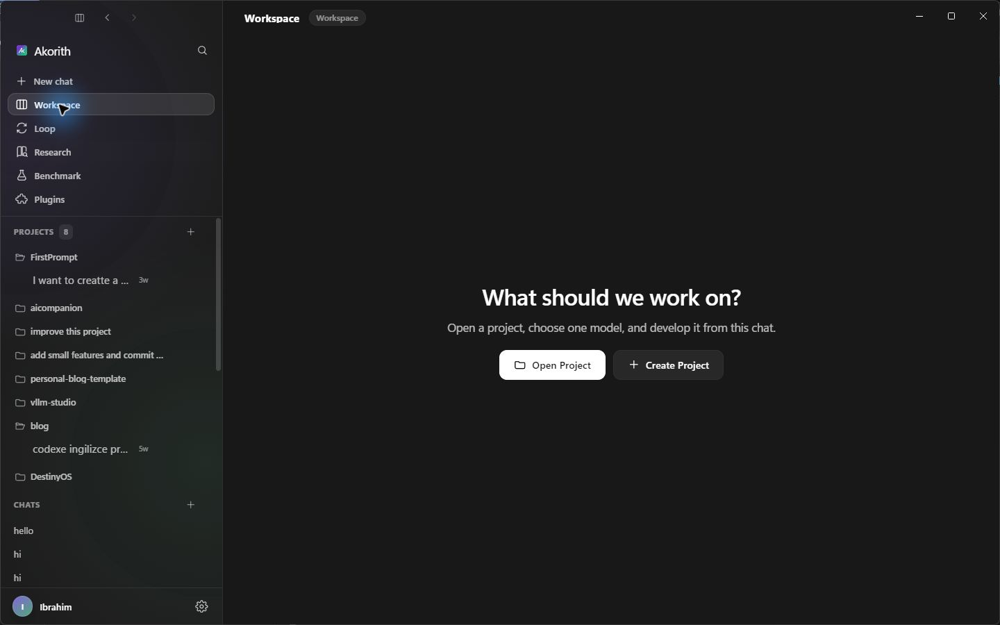
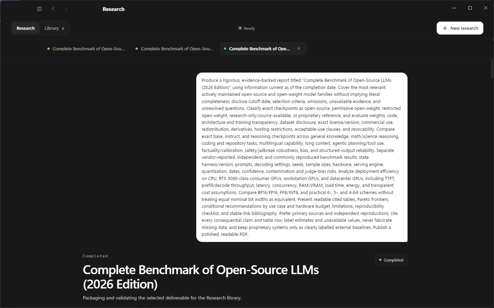
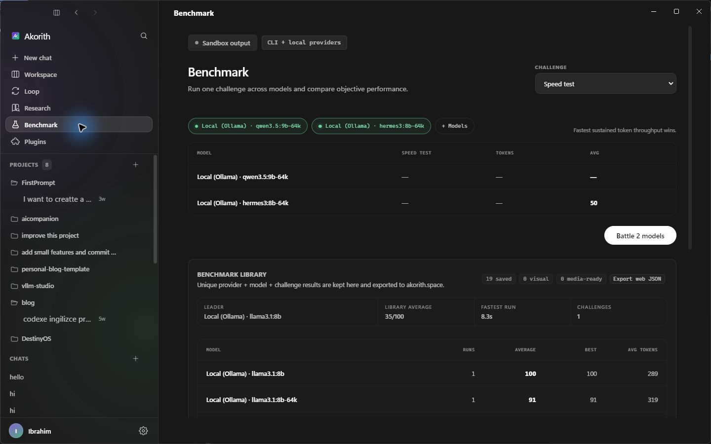

# Akorith

**A local-first Agent OS for chat, software work, autonomous loops, research, and model benchmarking.**

Akorith is a cross-platform Electron desktop app that brings your existing AI command-line tools
into one focused workspace. It works with your Claude, ChatGPT/Codex, OpenCode, and optional
Ollama setup, so there are no provider API keys to copy into the app. Projects, conversations,
usage, research evidence, and generated files remain on your machine.

> Current release: **v0.9.3** · Windows and macOS · Node.js 22+ recommended

## What you can do

| Surface | Purpose |
| --- | --- |
| **Chat** | Start a clean, project-free conversation with any available provider. |
| **Workspace** | Open a local project and let one selected CLI inspect, plan, edit, run, and explain its work. |
| **Loop** | Run durable goals through understand → plan → execute → verify → replan cycles, with cautious approval controls. |
| **Research** | Collect web evidence, verify claims, retain citations, and create Markdown, PDF, DOCX, XLSX, or PPTX deliverables. |
| **Benchmark** | Compare local and CLI-backed models with repeatable challenges and a persistent leaderboard. |
| **Plugins & Dashboard** | Manage optional local tools and review token, runtime, CPU, and GPU activity. |

Akorith supports concurrent work without mixing task state: in-flight responses, queued follow-ups,
research jobs, and long-running goals stay attached to the session that started them. Workspace also
includes Plan mode, `@` file mentions, real file diffs, stage/unstage controls, and a permissioned
localhost preview for web projects.

## Screenshots

### Workspace

Open or create a project, choose one model, and keep project history in the persistent sidebar.



### Autonomous Research

Research runs through planning, evidence collection, verification, writing, and export while keeping
its sources, findings, progress, and final deliverables together.



### Model Benchmark

Run the same challenge across models and keep objective results in the local benchmark library.



## Providers

- **Claude** through the `claude` CLI and your existing Claude login.
- **Codex / ChatGPT** through the `codex` CLI and your ChatGPT login.
- **OpenCode** through the `opencode` CLI.
- **Local models** through Ollama, including another reachable machine on your LAN or private VPN.

Any subset is enough. Missing providers appear as unavailable instead of preventing the app from
starting. Akorith invokes provider CLIs headlessly and renders their useful progress rather than
exposing raw terminal output as the main interface.

## Install

Download the latest artifact from [GitHub Releases](https://github.com/saitakarcesme/Akorith/releases):

- **Windows:** `Akorith-Setup-<version>-x64.exe` or the portable executable.
- **macOS:** `Akorith-<version>-mac-<arch>.dmg` or `.zip`.

Builds are currently unsigned. Windows SmartScreen or macOS Gatekeeper may therefore show a warning
on first launch. Code signing and notarization are planned.

To run from source:

```bash
git clone https://github.com/saitakarcesme/Akorith.git
cd Akorith
npm install
npm run dev
```

Useful commands:

```bash
npm run typecheck       # main, preload, and renderer TypeScript
npm run build           # production application build
npm run dist:win        # Windows installer + portable build
npm run dist:mac        # macOS dmg + zip
npm run release:check   # release identity and packaging preflight
```

See [Installation](docs/install.md), [Setup](docs/setup.md), and
[Packaging](docs/packaging.md) for platform-specific details.

## Research and generated artifacts

A bounded Research job moves through plan, research, verify, synthesize, and export. Continuous jobs
can keep cycling until paused, and up to three jobs can run concurrently. Checkpoints make interrupted
work recoverable after restart. Each result keeps a source ledger, claim-to-source citations,
validation state, checksum, cover preview, and versioned artifacts in the local library.

Web content is treated as untrusted evidence. Collection rejects private-network targets, limits
redirects and downloads, and records inaccessible or missing evidence instead of inventing values.
The current artifact pipeline can produce Markdown, PDF, DOCX, XLSX, and PowerPoint presentations.

## Local-first by design

- No AI-provider API keys or credentials are stored by Akorith.
- Chat history, projects, goals, research, and usage stay in local SQLite and managed app storage.
- Commands run locally in the project folder you explicitly select.
- Electron runs with context isolation and sandboxing enabled, Node integration disabled, a frozen
  preload bridge, and a strict Content Security Policy.
- Prompts are passed to provider CLIs over stdin, not interpolated into shell command strings.
- Auto Mode never chooses permanent “always allow” permissions and pauses on risky or ambiguous work.

## Project structure

```text
src/main/       Electron main process, providers, persistence, research, loops
src/preload/    Typed and validated IPC bridge
src/renderer/   React application and product surfaces
scripts/        Verification, packaging, setup, and release tooling
docs/           Architecture notes, phase records, setup, and operations guides
```

The provider registry is the source of truth for available backends. Every provider implements the
same streaming and usage contract, so Chat, Workspace, Loop, Research, and Dashboard can share
consistent model selection and accounting without hardcoding provider lists in the UI.

## Current limitations

- Windows and macOS packages are not yet code-signed or notarized.
- Linux is not currently tested.
- Auto Mode is deliberately cautious and pauses for destructive, medium/high-risk, low-confidence,
  or unclear actions.
- Ollama-dependent features require a reachable local or private-network Ollama server.

## Documentation

- [Controller API](docs/controller-api.md)
- [Remote Ollama runtime](docs/remote-runtime-sync.md)
- [Update system](docs/update-system.md)
- [Release checklist](docs/release-checklist.md)
- [Agent architecture guide](AGENTS.md)

Akorith is actively developed as a calm, chat-first desktop workspace for people who want the power
of local coding agents without giving up project boundaries, evidence, observability, or control.
